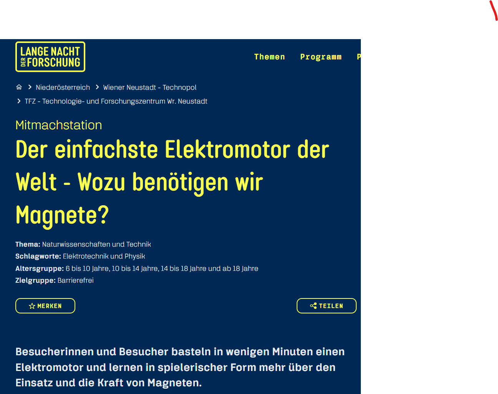
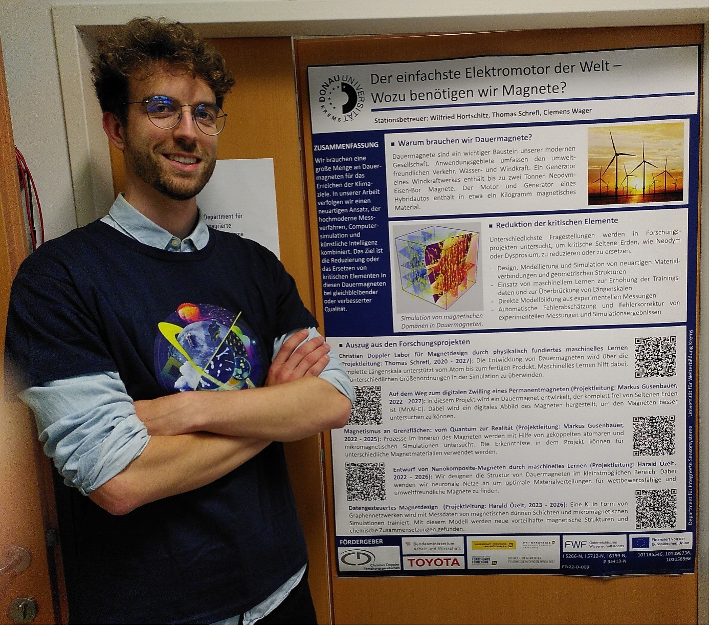
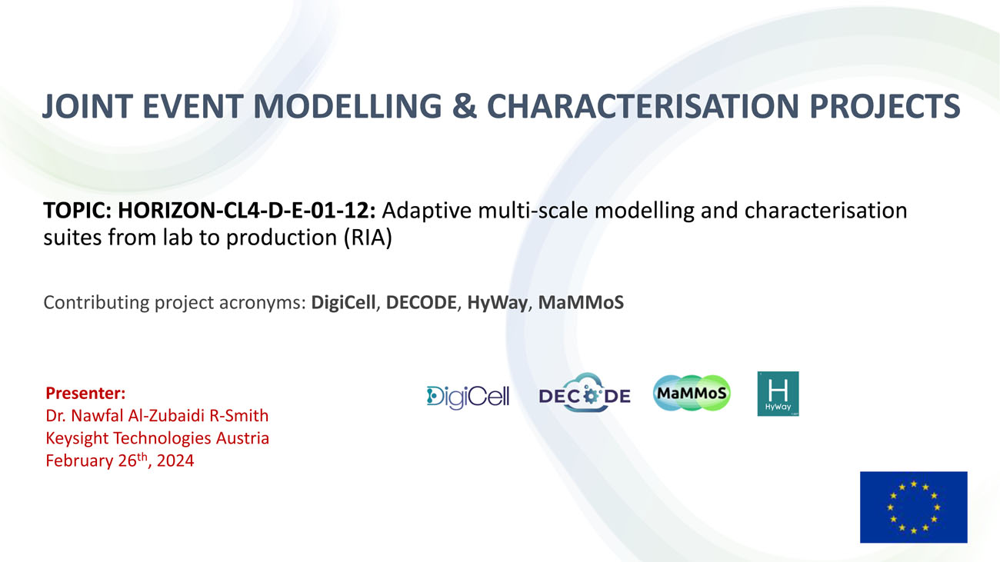

Events
======

`AI4AM2024 – Artificial Intellegence for Advanced Materials <https://ai4am.net/2024/program.php?d=03>`_
-------------------------------------------------------------------------------------------------------

**From 02nd – 04th July** AI4AM2024 takes place in Barcelona, Spain.
Timoteo Colnaghi (Max Planck Computing and Data Facility) takes part
in the conference with his contribution “The role of AI and ML in
the development of a Multiscale modelling suite for sustainable
magnetic materials”
:download:`Download abstract! <./_files/AI4AM2024_Colnaghi_Timoteo.pdf>`

`ICM2024 – International Conference on Magnetism <https://www.icm2024.org/focus-symposia/>`_
--------------------------------------------------------------------------------------------

.. image:: _static/icm_focused_session.png
    :width: 600

**From 30th June to 5th July** ICM 2024 took place in Bologna, Italy.
A Focus Session under the topic of `Magnetism in the age of AI <https://www.icm2024.org/focus-symposia/>`_
was chaired by Thomas Schrefl (UWK) and with Heike Herper
(Uppsala University) as invited speaker.

`Materials Week 2024 – Strategic R&I for the Value Chains of the Future <https://materials-week.org/>`_
-------------------------------------------------------------------------------------------------------

**From 17. to 21. June 2024** `MaterialsWeek 2024 <https://materials-week.org/>`_ took place in Cypres.
MaterialsWeek 2024 aims to bring togetheer – for the first time –
the numerous small and large Research and Innovation (R&I) communities
that are driving advances in materials innovation manifested across
diverse calue chains and industrial markets.
:download:`Magnetic Multiscale Modelling Suite, Thomas Schrefl <./_files/S03_T08_ThomasSchrefl.pdf>`

.. image:: _static/mw_photo.jpg
    :width: 600

© Alexander Simperler, Thomas Schrefl

`Lange Nacht der Forschung <https://langenachtderforschung.at/>`__
------------------------------------------------------------------

**On 24. May 2024,** the `Lange Nacht der Forschung <https://www.donau-uni.ac.at/de/aktuelles/news/2024/lange-nacht-der-forschung-2024.html>`__
took place at various venues across Austria. Our research booth in Krems showcased
how micromagnetic simulations and artificial intelligence can accelerate the discovery of
eco-friendly, sustainable, and cost-effective permanent magnets. Visitors actively
participated in the research by drawing magnets with various phase distributions and
crystal structures using felt-tip pens. Our trained AI then analyzed their designs,
predicting their potential performance. Through discussions, we emphasized the importance
of magnet research for the green energy transition in the fight against climate change.

.. image:: _static/LNF1.png
    :width: 600

© Harald Özelt, Markus Gusenbauer

© Clemens Wager

`2024 Annual General Meeting (AGM) of EMMC <https://emmc.eu/events/emmc-agm2024/>`_
-----------------------------------------------------------------------------------

On **7th May** the 2024 Annual General Meeting (AGM) of EMMC took place in Cambridge (UK) and online.

`Revision of CWA 17815:2021: “Materials Characterisation - Terminology, Metadata and Classification” - CEN-CENELEC (cencenelec.eu) <https://www.cencenelec.eu/news-and-events/news/2024/workshop/2024-04-22-nano/>`_
--------------------------------------------------------------------------------------------------------------------------------------------------------------------------------------------------------------------

The workshop organized from EMMC related initiative NanoMeCommons-CEN Workshop took place on **24th April 2024**

MaMMos and Open Model
---------------------

On **3rd April 2024** with Alex Simperler and Otello Roscioni.
Intro to Open Model Functionality and how it can aid with the developments in MaMMoS.

JOINT WORKSHOP ADVANCED MATERIALS CHARACTERISATION AND MODELLING PROJECTS
-------------------------------------------------------------------------

February 26th, 2024

KICK-OFF MEETING
----------------

.. image:: _static/Bild2.png
    :width: 600

Wiener Neustadt, January 9-10, 2024
