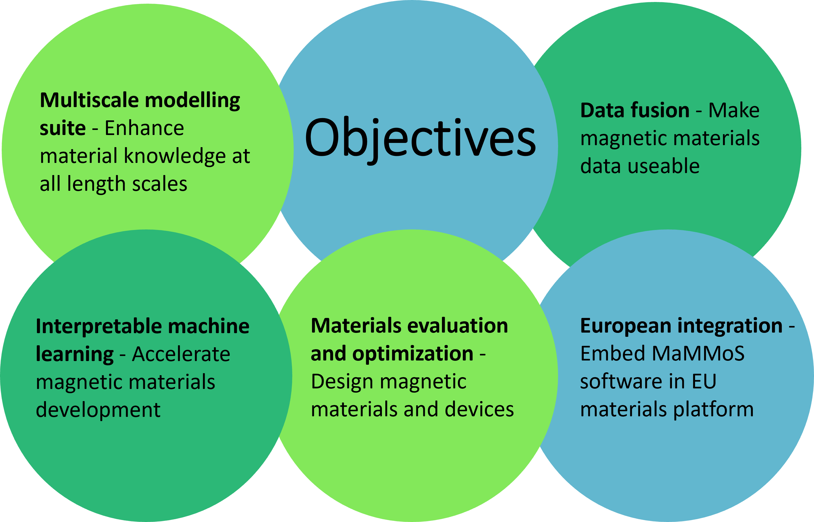

Objectives
==========

Challenges
----------

Magnets are crucial for many of today’s technologies, from the generators in wind turbines and the motors that
power electric vehicles, which help to reduce global heating, to computers, sensors and smartphones. Despite the
huge importance of magnets, the rare earths they contain are scarce and difficult to mine and separate, so their
production can cause serious environmental problems. In addition, 98 percent of these raw materials required in
the EU need to be imported – an aspect which causes significant economic dependencies.

Now scientists from Austria, France, Germany and Sweden are joining forces with two major technology companies
in a bid to develop more environmentally friendly magnets using sustainable materials. They are setting up an
open-source software platform, an enormously powerful tool kit of advanced modelling programs, to simulate the
behaviour of magnetic materials and tailor them to specific applications. The pioneering Magnetic Multiscale
Modelling Suite (MaMMoS) will combine experiments, simulation, and artificial intelligence (AI) to identify and
design innovative magnetic materials and optimise them for cutting-edge devices and sensors.

Solutions
---------

To achieve interoperability between software and analysis tools, we will establish a domain ontology for
magnetic materials. We will collaborate with EU magnet industry to create standards for linking simulation
software for magnetic materials from first principles simulations and micromagnetics to device level simulators.
MaMMoS will use artificial intelligence (AI) to fuse modeling and characterization data. AI methods will identify
and correct systematic errors in the simulation data, enabling more accurate predictions. Moreover, AI models can
fill gaps where measurements are not available. AI models can also serve as a surrogate in multi-objective
optimisation. Optimisation will guide further experiments or simulations, reducing the development time. In
MaMMoS, we will apply this approach to speed up the development of permanent magnets with reduced critical
elements for electric machines and to optimise the layout of magnetic field sensors for high linearity range.
The MaMMoS software will be validated against benchmarks defined according to the industrial requirements for
electric machine and sensor design.

Impacts
-------

The multiscale magnetic materials modeling suite will make open source to enable easy access to high-end
simulation tools. Interoperability will facilitate data sharing and reuse among researchers and industries.
Interpretable machine learning will reveal insights into the physics and chemistry of magnetic materials and
guide the discovery of new materials for the European green deal.

Disclaimer
----------

Funded by the European Union. Views and opinions expressed are however those of the author(s) only and do not
necessarily reflect those of the European Union or European Health and Digital Executive Agency (HADEA). Neither
the European Union nor the granting authority can be held responsible for them.
